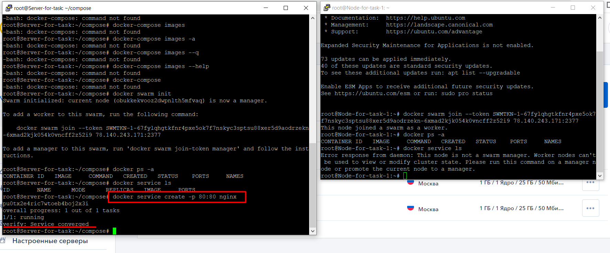
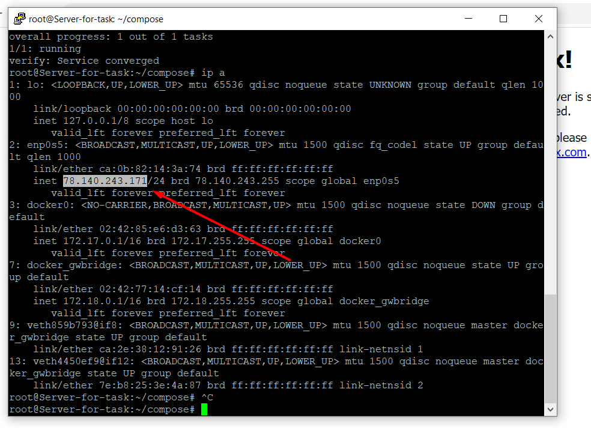
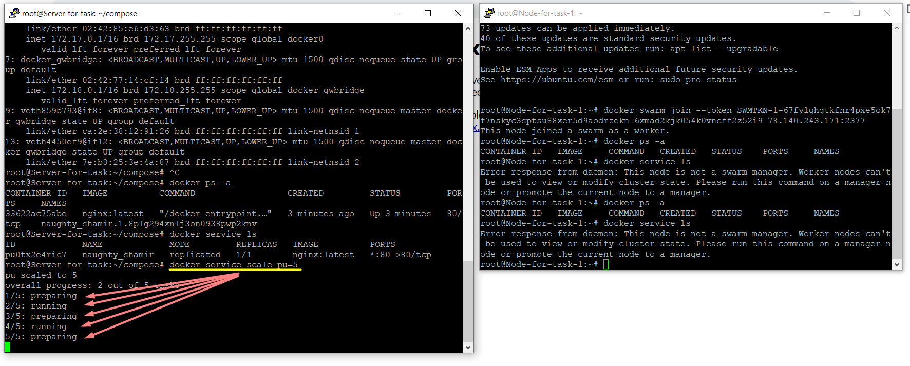
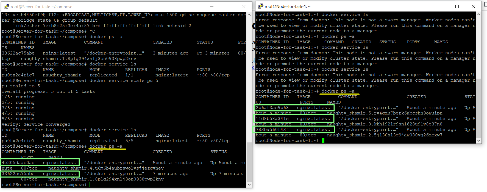
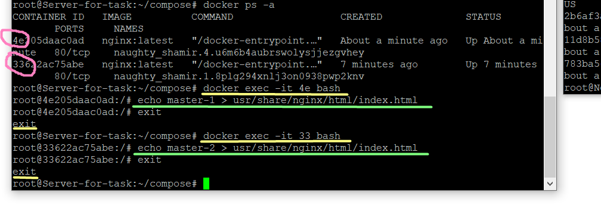
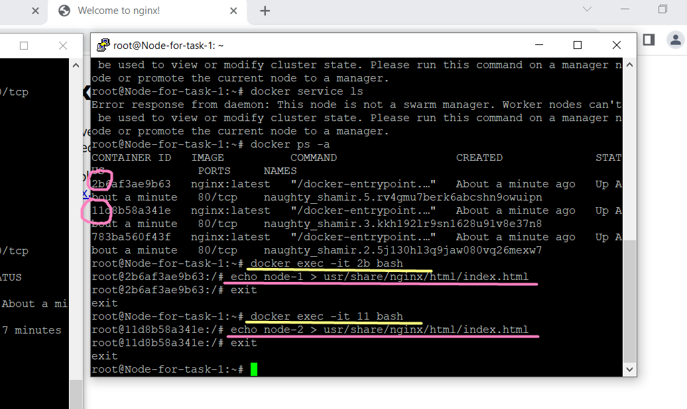
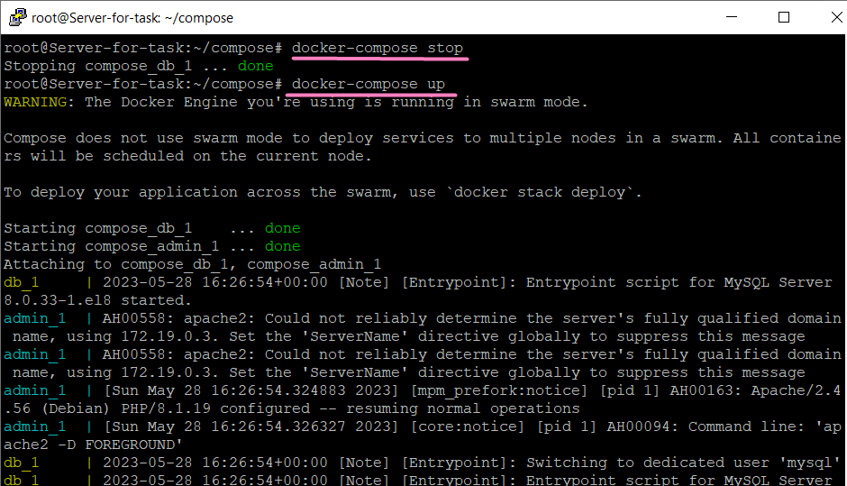
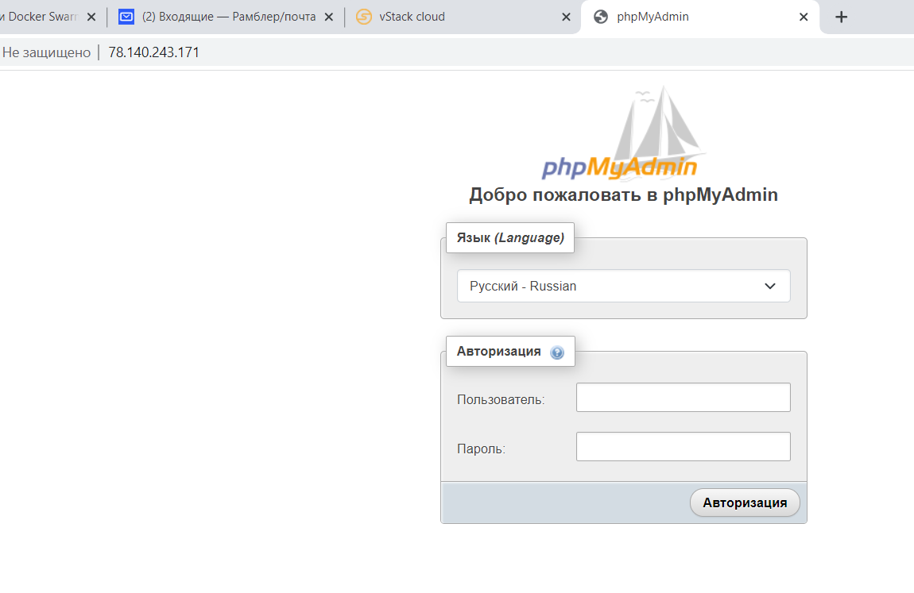

# Контейнеризация (семинары)

## Урок 5. Docker Compose и Docker Swarm

### **Информация о проекте**

Задание:
1) создать сервис, состоящий из 2 различных контейнеров: 1 - веб, 2 - БД
2) далее необходимо создать 3 сервиса в каждом окружении (dev, prod, lab)
3) по итогу на каждой ноде должно быть по 2 работающих контейнера
4) выводы зафиксировать

**Выполнение**

**Термины**

Для того чтобы пользоваться swarm, надо запомнить несколько типов сущностей:

Node - это наши виртуальные машины, на которых установлен docker. Есть manager и workers ноды. Manager нода управляет 
workers нодами. Она отвечает за создание/обновление/удаление сервисов на workers, а также за их масштабирование и 
поддержку в требуемом состоянии. Workers ноды используются только для выполнения поставленных задач и не могут управлять 
кластером.

Stack - это набор сервисов, которые логически связаны между собой. По сути это набор сервисов, которые мы описываем в 
обычном compose файле. Части stack (services) могут располагаться как на одной ноде, так и на разных.

Service - это как раз то, из чего состоит stack. Service является описанием того, какие контейнеры будут создаваться. 
Если вы пользовались docker-compose.yaml, то уже знакомы с этой сущностью. Кроме стандартных полей docker в режиме swarm 
поддерживает ряд дополнительных, большинство из которых находятся внутри секции deploy.

Task - это непосредственно созданный контейнер, который docker создал на основе той информации, которую мы указали при 
описании service. Swarm будет следить за состоянием контейнера и при необходимости его перезапускать или перемещать на 
другую ноду.

Теоретическое выполнение:
**Первый вариант решение(без использования второй node):**

Создаем два ДК-файла.

Компилируем node.

Проверяем.

Пытаемся задеплоить в Stack.

Получаем ошибку: "версия данного файла не поддерживается", продолжаем делать, как делали на семинаре.
Запускаем первый ДК-файл.

Проверяем.
Запускаем второй ДК-файл.

Воспользуемся функционалом Docker Swarm и создадим дубликат одного и того же образа.

Аналогично можем проделать с другими образами, далее повязать их сетью и получить полные дубликаты: БД + WEB.

**Второй вариант решение(с использованием второй node):**

Подключаемся по SSH ко второй VM и устанавливаем swarm соединение, предварительно инициализировав manager node.

Запускаем первый ДК-файл на manager node.

Проверяем.
Запускаем второй ДК-файл на worker node.

Проверяем.

Попробуем запустить первый ДК-файл на node worker.

Проверяем, все работает, ошибки дублирования не произошло т. к имена image разные(ДК-файлы в разных директориях 
находятся на VM)

Запускаем на manager node второй ДК-файл и получаем четыре работающих контейнера на одной node и на другой
(не считая hello-word).

Если бы расположение папок было идентично на manager node и worker node, пришлось бы создавать реплики образов и 
обвязывать их сетью.

Тем временем наблюдаем за статусом worker node, он "упал"(Отказался идти на повышение). Переподключаем swarm соединение.

Создаем еще реплики образов и видим как система их перераспределяет.

Для того чтобы сервисы распределять на определенные ноды необходимо применять labels
(подробнее об этом тут: https://habr.com/ru/articles/659813/)

